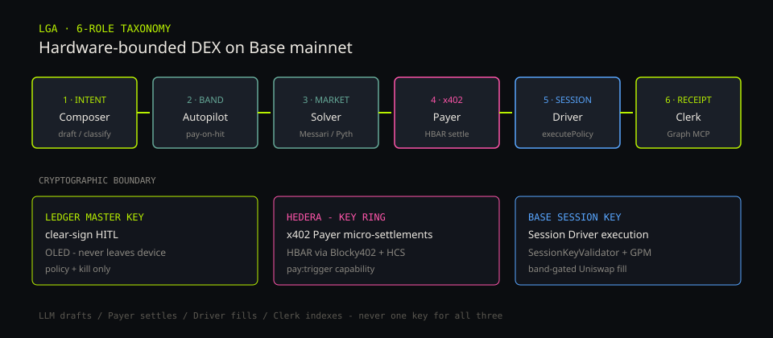
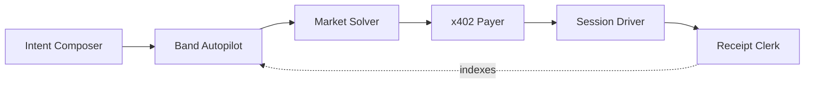

# Ledger Guardian Agent (LGA)

[](./docs/ANCHOR.md)
[](./docs/HACKATHON.md)
[](https://basescan.org/address/0xdBf463E260573797Dd1a03B4f45876aad777453b)
[](./docs/proofs/x402-settle.md)
[](https://thegraph.com/studio/subgraph/ledger-guardian-agent)
[](https://ledger-gaurd.vercel.app/)

**Hardware-bounded delegation for autonomous DeFi exits — tested on Base mainnet, built for production.**





| Role | Code id | Job |
|---|---|---|
| **Intent Composer** | `composer` | Classify / draft — never pays, never fills |
| **Band Autopilot** | `autopilot` | Watch Graph + Hermes; pay when in band |
| **Market Solver** | `solver` | Messari / Pyth risk explain — no Graph tools |
| **x402 Payer** | `payer` | HBAR micro-settle → unlock `/trigger` |
| **Session Driver** | `driver` | `executePolicy` with Base session key |
| **Receipt Clerk** | `clerk` | Receipt Graph / Subgraph MCP only |

**Live product:** [https://ledger-gaurd.vercel.app/](https://ledger-gaurd.vercel.app/) · **Keeper:** [https://lga-keeper-production.up.railway.app](https://lga-keeper-production.up.railway.app)

Master key never leaves Ledger. Key Ring holds keeper secrets. The Graph is load-bearing.

---

## Hardware / cryptographic boundary

Three keys. Three jobs. No single process holds all three as “god mode.”

| Key material | Who uses it | What it authorizes |
|---|---|---|
| **Ledger master key** | Intent Composer path + human HITL | Clear-sign `setGuardianPolicy` / `killSwitch` on OLED. Creates or destroys delegation. **Never exported to keeper, LLM, or Key Ring.** |
| **Hedera pay material (Key Ring)** | **x402 Payer** | Micro-settlements: HBAR via Blocky402 to unlock `POST /trigger`. Scoped as `pay:trigger` / `pay:quote`. Does **not** sign Base fills. |
| **Base session key (Key Ring)** | **Session Driver** | Band-gated `executePolicy` through **SessionKeyValidator** → GuardianPolicyManager → Uniswap. Capability `execute:policy:<id>`. Cannot widen policy bands. |

```text
Ledger OLED ──HITL──► Base policy / kill     (master key stays on device)
Key Ring    ──pay───► Hedera x402 settle     (Payer only)
Key Ring    ──exec──► SessionKeyValidator    (Driver only)
Receipt Graph ◄────── ExecutionReceipt       (Clerk indexes; Autopilot reads)
```

Implementation:

- Clear-sign: [`packages/hardware-test/src/policyTx.ts`](packages/hardware-test/src/policyTx.ts) · [`packages/web/src/lib/policyTx.ts`](packages/web/src/lib/policyTx.ts)
- Key Ring load: [`packages/keeper/src/ring.ts`](packages/keeper/src/ring.ts)
- Capability broker: [`packages/keeper/src/capabilities.ts`](packages/keeper/src/capabilities.ts)
- Session fill: [`packages/keeper/src/executor.ts`](packages/keeper/src/executor.ts)

---

## Code deep-links (read the hot path)

### Keeper roles

| Role | File |
|---|---|
| Intent Composer / dispatch | [`packages/keeper/src/agent/orchestrate.ts`](packages/keeper/src/agent/orchestrate.ts) |
| Market Solver | [`packages/keeper/src/agent/solver.ts`](packages/keeper/src/agent/solver.ts) |
| Receipt Clerk | [`packages/keeper/src/agent/clerk.ts`](packages/keeper/src/agent/clerk.ts) · [`subgraphMcp.ts`](packages/keeper/src/agent/subgraphMcp.ts) |
| x402 Payer | [`packages/keeper/src/paidTrigger.ts`](packages/keeper/src/paidTrigger.ts) · [`x402.ts`](packages/keeper/src/x402.ts) |
| Band Autopilot | [`packages/keeper/src/payOnHit.ts`](packages/keeper/src/payOnHit.ts) |
| Session Driver + cycle | [`packages/keeper/src/executor.ts`](packages/keeper/src/executor.ts) · [`cycle.ts`](packages/keeper/src/cycle.ts) |
| Host `/trigger` | [`packages/keeper/src/index.ts`](packages/keeper/src/index.ts) |
| HCS audit | [`packages/keeper/src/hcsAudit.ts`](packages/keeper/src/hcsAudit.ts) |

### Base mainnet contracts ([Basescan](https://basescan.org))

| Contract | Address |
|---|---|
| GuardianPolicyManager (BUY_DIP) | [`0xdBf463E260573797Dd1a03B4f45876aad777453b`](https://basescan.org/address/0xdBf463E260573797Dd1a03B4f45876aad777453b) |
| SessionKeyValidator | [`0xf93f56DF8481144F507dFCf30712658202E164e4`](https://basescan.org/address/0xf93f56DF8481144F507dFCf30712658202E164e4) |
| SwapExecutor | [`0x4767a9Deee297d73B72cDD850850D11B221034Ab`](https://basescan.org/address/0x4767a9Deee297d73B72cDD850850D11B221034Ab) |
| Pyth | [`0x8250f4aF4B972684F7b336503E2D6dFeDeB1487a`](https://basescan.org/address/0x8250f4aF4B972684F7b336503E2D6dFeDeB1487a) |
| Uniswap SwapRouter02 | [`0x2626664c2603336E57B271c5C0b26F421741e481`](https://basescan.org/address/0x2626664c2603336E57B271c5C0b26F421741e481) |

Solidity: [`packages/contracts/`](packages/contracts/)

### Hedera (x402 + HCS)

| Artifact | ID / URL |
|---|---|
| HCS payment topic | [`0.0.10423816`](https://hashscan.io/testnet/topic/0.0.10423816) |
| Example memo | `hcs://0.0.10423816/1` — [`docs/proofs/phase-d-hcs.md`](docs/proofs/phase-d-hcs.md) |
| Unpaid 402 + paid settle | [`docs/proofs/x402-settle.md`](docs/proofs/x402-settle.md) |
| Example settle tx | [`0.0.7162784@1789203702.106539865`](https://hashscan.io/testnet/transaction/0.0.7162784%401789203702.106539865) |

### Mainnet txs (evidence)

| What | Tx |
|---|---|
| Clear-sign policy | [`0x89d9ce25…`](https://basescan.org/tx/0x89d9ce25007ed4ab4d2b5a0ed39a183c8dba2bd0b23e999059fcf0323098746b) |
| Kill switch | [`0x6a93c38a…`](https://basescan.org/tx/0x6a93c38a2278ffa2fbbdc7dbc76c642c6702a5102ff45053faeef55978895b8b) |
| Take-profit fill | [`0xb6f315a4…`](https://basescan.org/tx/0xb6f315a435e6dfd19607d9b662fdb0415fd476a21937f0a2c7b8d78d882371d3) |

Sponsor briefs: [`docs/sponsors/LEDGER.md`](docs/sponsors/LEDGER.md) · [`GRAPH.md`](docs/sponsors/GRAPH.md) · [`HEDERA.md`](docs/sponsors/HEDERA.md)

---

## Production posture

| Surface | Network / deploy | Status |
|---|---|---|
| GuardianPolicyManager + fills | **Base mainnet (8453)** | Clear-sign, kill, Uniswap fills |
| Pyth | Base mainnet + Hermes VAAs | Same feeds the contract verifies |
| Receipt Graph | Studio + Gateway | Live policies / `ExecutionReceipt` — no mocks |
| Web | Vercel | https://ledger-gaurd.vercel.app/ |
| Keeper | Railway · `POLL_MS=0` | Host + consumer x402 |
| Hedera x402 | `hedera:testnet` · Blocky402 | Live 402 → settle → attempt |

---

## Why this exists

Autonomous DeFi agents need to move funds when markets move — without a human online holding hot keys, and without an LLM ever constructing or broadcasting an irreversible transaction.

LGA splits authority:

1. **Ledger master key** — HITL for policy + kill.
2. **Base session key** — Driver fills only inside clear-signed bands + Pyth.
3. **Hedera Key Ring pay path** — meters each attempt; **Receipt Graph** tells Autopilot what to evaluate and Clerk what filled.

Intent Composer / Market Solver / Receipt Clerk reason. They do not pay and do not fill.

---

## How it works

### 1. Clear-sign (Ledger master key)

Protect / Agent drafts → OLED confirms `setGuardianPolicy` on Base.


### 2. Agents in hard scopes

SSE `/protect/agent`: Composer routes; Clerk → Graph only; Solver blocked from Graph tools.


### 3. Pay → evaluate → fill

Unpaid `/trigger` → **402**. x402 Payer settles HBAR → Band Autopilot / cycle → Session Driver may fill → Receipt Clerk indexes.


---

## Quickstart

```bash
git clone https://github.com/n1shanthb/Ledger-gaurd && cd Ledger-gaurd

cd packages/web && cp ../../.env.example .env.local
npm install && npm run dev          # :3000

cd ../keeper
# WALLET_PASS=… LGA_SECRETS_SOURCE=ring POLL_MS=0 npm start
npm install && npm start            # :3001

cd ../hardware-test && npm install && npm run dev   # Ledger USB → Base mainnet
```

```bash
curl -i -X POST https://lga-keeper-production.up.railway.app/trigger \
  -H "content-type: application/json" -d "{}"
# HTTP 402 Payment Required
```

Env: [`.env.example`](.env.example) · Prize matrix: [`docs/HACKATHON.md`](docs/HACKATHON.md) · Anchor: [`docs/ANCHOR.md`](docs/ANCHOR.md)

---

## Repo layout

```text
packages/
  web/             Protect + Agent (Next.js) — Vercel
  hardware-test/   DMK clear-sign + kill — Base mainnet
  contracts/       GPM · SessionKeyValidator · SwapExecutor
  subgraph/        Receipt Graph
  keeper/          Six roles · x402 · Key Ring · cycle
  graph-data/      Messari fan-out
clear-signing/     ERC-7730
docs/              Sponsors · proofs · this architecture SVG
```

---

## License

TBD — ETHOnline 2026.

## Team

ETHOnline 2026 · **Start Fresh** · Ledger × The Graph × Hedera · **Base mainnet tested**.
