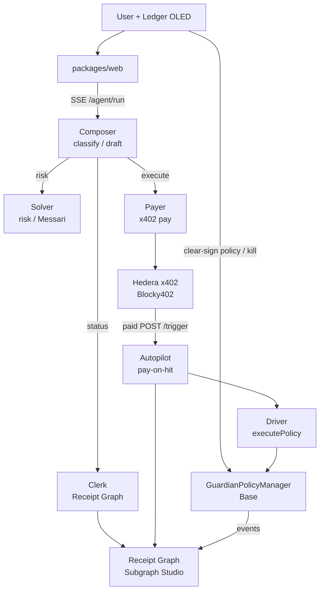

# Ledger Guardian Agent (LGA)

[](./docs/ANCHOR.md)
[](./docs/HACKATHON.md)
[](./docs/proofs/x402-settle.md)
[](https://api.studio.thegraph.com/query/1758709/ledger-guardian-agent/v0.0.4)
[](#license)

**Hardware-bounded delegation for autonomous DeFi exits.** Users clear-sign stop-loss / take-profit / buy-dip bounds on a Ledger OLED. A six-role keeper discovers policies via The Graph **Receipt Graph**, pays HBAR through **x402** (Blocky402) to attempt execution on Base, and indexes every fill as a compliance receipt. The master key never leaves the device; Key Ring holds keeper secrets.


<!-- REPLACE: full-page screenshot of localhost:3000/ (or /protect) landing, light mode, brand visible -->

---

## Why this exists

Autonomous DeFi agents need to move funds when markets move — without a human online holding hot keys, and without an LLM ever constructing or broadcasting an irreversible transaction.

Most “AI DeFi” demos collapse one of those constraints: either the model (or a server) holds the signing key, or the agent has unbounded wallet authority. LGA splits authority across three systems:

1. **Ledger** grants what may be delegated (policy + kill) and holds the master key.
2. **Base contracts + session key** (Key Ring) execute only when on-chain bands and Pyth checks pass.
3. **Hedera x402** meters each execution *attempt*; **The Graph** is how the keeper knows which policies exist and whether fills were compliant.

The LLM layer (Composer / Solver / Clerk) classifies, explains, and drafts. It does not pay and does not fill.

---

## Architecture



**Implementation entrypoints**

| Role | Kind | Code |
|---|---|---|
| Composer / dispatch | LLM + router | [`packages/keeper/src/agent/orchestrate.ts`](packages/keeper/src/agent/orchestrate.ts) (`DISPATCH`) |
| Clerk | LLM + Graph only | [`packages/keeper/src/agent/clerk.ts`](packages/keeper/src/agent/clerk.ts) |
| Solver | LLM + Messari/Pyth | [`packages/keeper/src/agent/solver.ts`](packages/keeper/src/agent/solver.ts) |
| Payer | Non-LLM | [`packages/keeper/src/paidTrigger.ts`](packages/keeper/src/paidTrigger.ts) |
| Autopilot | Non-LLM | [`packages/keeper/src/payOnHit.ts`](packages/keeper/src/payOnHit.ts) |
| Driver | Non-LLM | [`packages/keeper/src/executor.ts`](packages/keeper/src/executor.ts) |
| Cycle | Graph → Pyth → fill | [`packages/keeper/src/cycle.ts`](packages/keeper/src/cycle.ts) |

Agent trust boundaries (what chat can and cannot do): [`docs/AGENT_AUDIT.md`](docs/AGENT_AUDIT.md).

---

## How it works

### 1. Clear-sign a protection

User drafts bands in the web Agent / Protect UI (or hardware-test). Ledger confirms `setGuardianPolicy` on Base.


<!-- REPLACE: screenshot of /protect/agent Policy draft card with editable bands + Confirm for Ledger -->

**Proven clear-sign broadcast (hardware-test path):**  
[Basescan `0x89d9ce25007ed4ab4d2b5a0ed39a183c8dba2bd0b23e999059fcf0323098746b`](https://basescan.org/tx/0x89d9ce25007ed4ab4d2b5a0ed39a183c8dba2bd0b23e999059fcf0323098746b) — also recorded in [`docs/LEDGER_DX_FEEDBACK.md`](docs/LEDGER_DX_FEEDBACK.md).

Additional policy / kill examples cited in [`docs/HACKATHON.md`](docs/HACKATHON.md):  
[policy `0x6c249efd…`](https://basescan.org/tx/0x6c249efd8f5dcec73b33fc6d155e24f7f53274f2fb167bf8f6eae6d7cc27a7a9) · [kill `0x6a93c38a…`](https://basescan.org/tx/0x6a93c38a2278ffa2fbbdc7dbc76c642c6702a5102ff45053faeef55978895b8b).

### 2. Agents reason inside hard scopes

SSE run on `/protect/agent` animates only from keeper frames. Clerk alone hits Receipt Graph (`queryReceiptGraphNl`); Solver is blocked from Graph tools in code.


<!-- REPLACE: /protect/agent with AgentOpsGraph mid-run — Composer→Clerk edge lit, tool_start visible -->


<!-- REPLACE: agent event / SSE panel showing a real gate warn (proceed=false) from ensureSolverGate — capture from local keeper run -->

### 3. Pay to attempt; fill only if bands hit

Unpaid `POST /trigger` → **402**. Paid settle (HBAR via Blocky402) → cycle evaluates policies from Graph + Pyth → Driver may `executePolicy`. **Payment ≠ fill.**


<!-- REPLACE: HashScan testnet tx page for 0.0.7162784@1789203702.106539865 (or latest paid settle) -->


<!-- REPLACE: Basescan page for a TAKE_PROFIT fill, e.g. 0x41a4e8ced5804985faaac056f03567460e15f66dbec2f8062065744448f1ac51 -->

**Live paid settle (no fill that run — `evaluated:0`):** [`docs/proofs/x402-settle.md`](docs/proofs/x402-settle.md) · HashScan [settle tx](https://hashscan.io/testnet/transaction/0.0.7162784%401789203702.106539865) · HCS [`hcs://0.0.10423816/1`](https://hashscan.io/testnet/topic/0.0.10423816).

**Indexed fills (Clerk live Studio):** [`docs/proofs/phase-c1.md`](docs/proofs/phase-c1.md) — tx hashes `0x41a4e8ce…f1ac51`, `0x5941f3d2…5303fe8`.

---

## Quickstart

```bash
git clone <this-repo> && cd ledgergaurd

# Web (Protect + Agent UI)
cd packages/web && cp ../../.env.example .env.local   # fill GRAPH_API_KEY, RPC, keeper URL
npm install && npm run dev
# → http://127.0.0.1:3000/protect

# Keeper (agents + x402 host/consumer)
cd ../keeper
# Prefer Key Ring: see packages/keeper/README.md § Key Ring
# WALLET_PASS=… LGA_SECRETS_SOURCE=ring POLL_MS=0 npm start
npm install && npm start
# → http://127.0.0.1:3001/health

# Ledger clear-sign demo (USB)
cd ../hardware-test && npm install && npm run dev
```

**Public keeper (prize mode `POLL_MS=0`):** `https://lga-keeper-production.up.railway.app`  
**Unpaid gate check:**

```bash
curl -i -X POST https://lga-keeper-production.up.railway.app/trigger \
  -H "content-type: application/json" -d "{}"
# expect HTTP 402 + payment-required — capture in docs/proofs/x402-settle.md
```

Env template: [`.env.example`](.env.example). Full prize matrix: [`docs/HACKATHON.md`](docs/HACKATHON.md).

---

## Sponsor docs (open these)

| Doc | What’s inside |
|---|---|
| [`docs/sponsors/GRAPH.md`](docs/sponsors/GRAPH.md) | Receipt Graph as load-bearing automation + Subgraph MCP Clerk + Messari compose — proofs and file map |
| [`docs/sponsors/LEDGER.md`](docs/sponsors/LEDGER.md) | DMK clear-sign, Key Ring, capability broker, “session key never enters LLM context” |
| [`docs/sponsors/HEDERA.md`](docs/sponsors/HEDERA.md) | x402 host+consumer, Blocky402 settle, HCS audit trail |

Canonical product truth: [`docs/ANCHOR.md`](docs/ANCHOR.md). Agent room audit: [`docs/AGENT_AUDIT.md`](docs/AGENT_AUDIT.md).

---

## Repo layout

```text
packages/
  web/             Protect + Agent ops UI (Next.js)
  hardware-test/   Ledger DMK clear-sign + kill
  contracts/       GuardianPolicyManager (Foundry)
  subgraph/        Receipt Graph schema + mappings
  keeper/          Agents, x402, Key Ring, cycle
  graph-data/      Messari fan-out decisions
clear-signing/     ERC-7730 descriptors
docs/              Anchor, proofs, sponsor briefs
```

---

## Plan vs code (read before judging)

These are intentional honesty notes, not TODOs disguised as features:

| Topic | Plan / older docs | Current tree |
|---|---|---|
| Agent names | ANCHOR still mentions Coordinator / Sentinel / Oracle | Six ids: composer / solver / clerk / payer / autopilot / driver — [`phase-a.md`](docs/proofs/phase-a.md) |
| Graph endpoint | Proofs + `.env.example` use **Studio** `…/v0.0.4` | Web proxy [`packages/web/src/app/api/receipt-graph/route.ts`](packages/web/src/app/api/receipt-graph/route.ts) prefers **Gateway** id `GfvNLa3…` and returns 503 if pointed at Studio |
| GPM address | Multiple historical deploys | Confirm which address your `.env` / OLED flow uses before demos |
| Railway Key Ring | Prize wants `headless=true` + ring | Captured health: `source=env`, `headless=false` — [`docs/proofs/phase-c2/railway-health.json`](docs/proofs/phase-c2/railway-health.json) |

---

## License

[PROOF NEEDED: add a root `LICENSE` file and update the badge above]

## Team

ETHOnline 2026 · **Start Fresh** (net-new) submission — Ledger × The Graph × Hedera.
